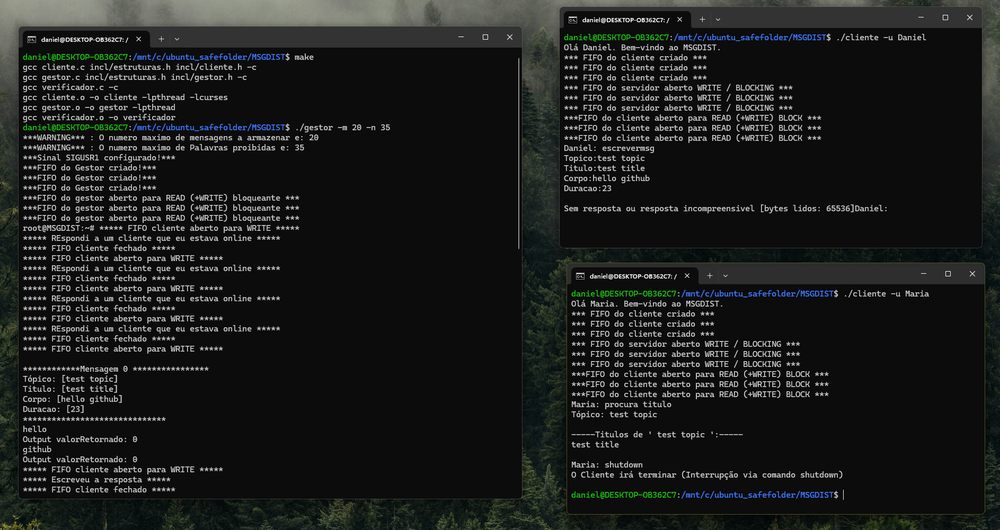

# MSGDIST
A simple Unix-based message distribution system written in C. Clients can send, receive, and subscribe to messages by topic. Focused on system-level programming using OS calls.

Discover additional projects from this class in the [Sistemas Operativos repository](https://github.com/danielmribeiro/isec-lei-sistemas-operativos).

For more course-related assignments, check out the [Engenharia Informatica repository](https://github.com/danielmribeiro/engenharia-informatica).

